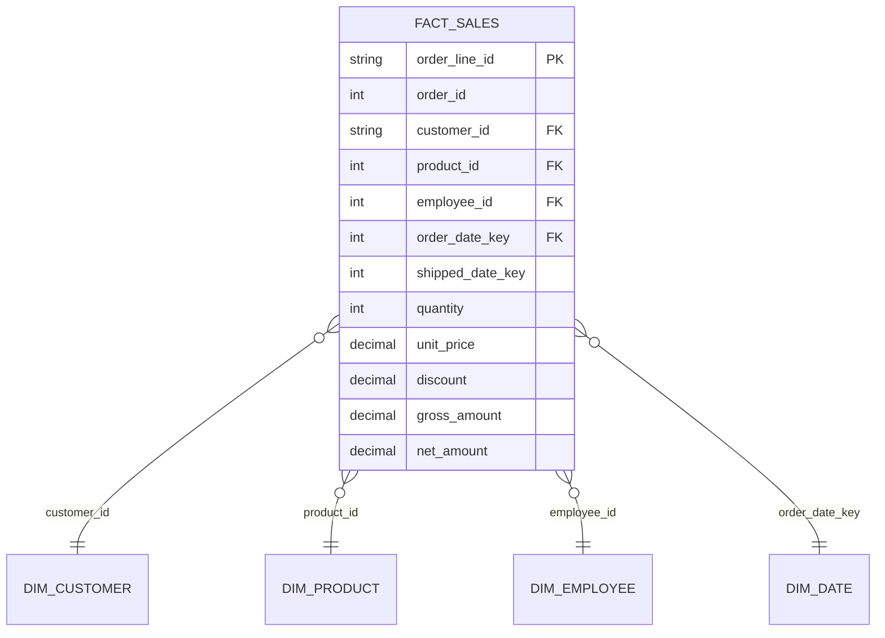

# Snowflake Star Schema with dbt

A star schema data warehouse built on the Northwind sales dataset (830 orders, 2,155 order lines). Raw CSVs are loaded into Snowflake with `dbt seed`, cleaned in staging models, and modeled into one fact table and four dimension tables with dbt Core.

## Star schema



Grain of `fact_sales`: one row per order line (order and product).

## Project layout

| Folder | Contents |
|---|---|
| `seeds/` | Raw Northwind CSVs (customers, orders, order details, products, employees, categories, suppliers, shippers) |
| `models/staging/` | One view per source table: renamed columns, typed dates, category and supplier joined into products |
| `models/marts/` | `fact_sales`, `dim_customer`, `dim_product`, `dim_employee`, `dim_date` |
| `tests/` | Two singular tests: fact rows match source order lines, and net amount is never negative or above gross |

## Data quality checks

30 dbt tests: unique and not_null on every key, relationships from the fact table to all four dimensions, plus the two singular tests above.

## How to run

1. Create a Snowflake trial account, then in a worksheet run: `create database NORTHWIND_DB; create schema NORTHWIND_DB.ANALYTICS;`
2. `pip install dbt-snowflake`
3. Copy `profiles.yml.example` to `~/.dbt/profiles.yml` and fill in your account, user and password.
4. From this folder run:

```
dbt seed
dbt run
dbt test
```

## Sample query

```sql
select p.category_name, round(sum(f.net_amount), 0) as net_sales
from fact_sales f
join dim_product p on f.product_id = p.product_id
group by 1
order by 2 desc;
```

Top results: Beverages (about 267,868), Dairy Products (about 234,507), Confections (about 167,357). Total net sales across all lines: about 1,265,793.

## Data source

Northwind sample dataset (public CSV export). Photo and picture columns were removed from the seeds.
